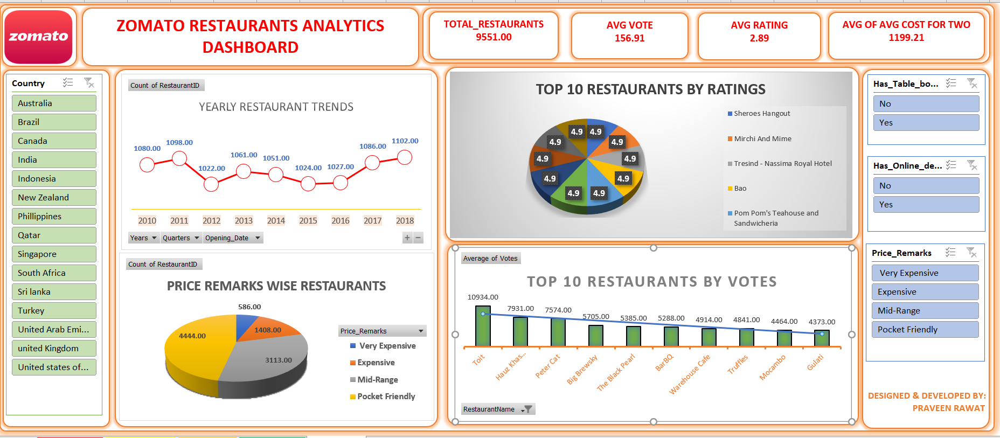
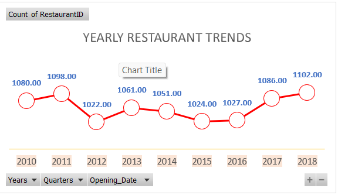
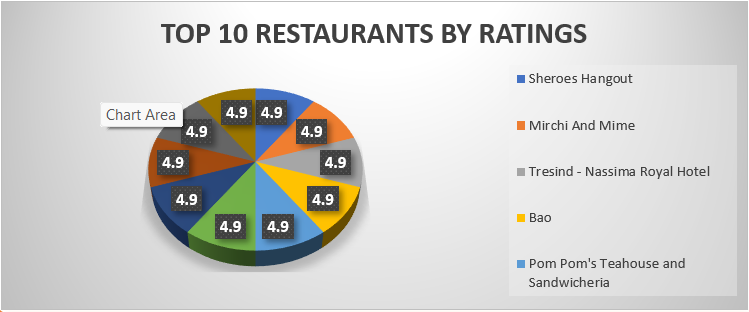

# 🍽️ Zomato Restaurant Analytics Dashboard | Excel Data Analytics Project

## 📊 Interactive Excel Dashboard for Restaurant Performance Analysis & Business Insights

# 📌 Project Overview

The **Zomato Restaurant Analytics Dashboard** is a dynamic Excel-based Business Intelligence project designed to analyze restaurant data from multiple countries. This dashboard transforms raw restaurant information into meaningful business insights using **Pivot Tables, Pivot Charts, Slicers, KPIs, and Interactive Visualizations**.

The objective of this project is to help stakeholders understand restaurant performance, customer ratings, voting behavior, pricing categories, and yearly restaurant trends through an easy-to-use interactive dashboard.

This project demonstrates practical Excel skills required for a **Data Analyst** role, including data cleaning, data transformation, dashboard designing, KPI reporting, and business analysis.

# 📂 Project Structure:

       📁 Zomato-Restaurant-Analytics
        │
        ├── 📄 README.md
        ├── 🖼️ Dashboard.png
        ├── 📈 Yearly_Trend.png
        ├── ⭐ Top10_Restaurants_by_Rating.png
        └── 👍 Top10_Restaurants_by_Votes.png

# 🎯 Business Problems Solved

✔️ Identify restaurants with the highest customer ratings.

✔️ Find restaurants receiving the maximum customer votes.

✔️ Analyze restaurant growth over the years.

✔️ Compare restaurant distribution by pricing categories.

✔️ Filter restaurant insights by country.

✔️ Analyze online delivery availability.

✔️ Analyze table booking availability.

✔️ Provide management with interactive business reports.

# 📊 Dashboard KPIs                            

   🍽️ Total Restaurants             
   ⭐ Average Rating                
   👍 Average Votes                 
   💰 Average Cost for Two  
   
# 📈 Dashboard Features

## 📅 Yearly Restaurant Trends

- Restaurant openings by year
- Growth trend analysis
- Interactive timeline filtering

## ⭐ Top 10 Restaurants by Ratings

- Highest-rated restaurants
- Quick identification of premium restaurants
- Rating comparison

## 👍 Top 10 Restaurants by Votes

- Most popular restaurants
- Customer engagement analysis
- Voting comparison

## 💰 Price Category Analysis

Restaurants classified into:

- 💎 Very Expensive
- 💰 Expensive
- 🏷️ Mid-Range
- 🍔 Pocket Friendly

## 🌍 Country-wise Analysis

Interactive filtering available for:

- Australia
- Brazil
- Canada
- India
- Indonesia
- New Zealand
- Philippines
- Qatar
- Singapore
- South Africa
- Sri Lanka
- Turkey
- UAE
- United Kingdom
- United States

## 🍽️ Table Booking Analysis

Filter restaurants based on:

- ✅ Table Booking Available
- ❌ Table Booking Not Available

## 🚚 Online Delivery Analysis

Analyze restaurants offering:

- ✅ Online Delivery
- ❌ No Online Delivery

# ⚙️ Dashboard Filters (Dynamic Slicers)

✔️ Country

✔️ Price Category

✔️ Online Delivery

✔️ Table Booking

✔️ Year

All dashboard visuals update dynamically based on slicer selections.

# 🛠️ Tools & Technologies Used

   Tool                             

📊 Microsoft Excel    
📑 Pivot Tables       
📈 Pivot Charts        
🎛️ Slicers           
🧮 Excel Functions    
🎨 Excel Formatting  
📌 KPIs               

# 📂 Dataset Information

The dataset contains restaurant-related information including:

- Restaurant ID
- Restaurant Name
- Country
- City
- Opening Date
- Average Rating
- Votes
- Price Range
- Average Cost for Two
- Online Delivery
- Table Booking
- Price Remarks

# 📊 Key Insights

📌 More than **9,500+ restaurants** were analyzed.

📌 Restaurant openings showed varying trends across different years.

📌 A small number of restaurants achieved the highest customer ratings.

📌 Customer voting patterns reveal the most popular restaurants.

📌 Pocket-friendly restaurants represent the largest share of the dataset.

📌 Interactive filters allow country-wise and service-wise business analysis.

# 💼 Skills Demonstrated

## 📊 Data Analytics

- Data Cleaning
- Data Validation
- Business Analysis
- KPI Reporting
- Data Visualization

## 📈 Excel Skills

- Pivot Tables
- Pivot Charts
- Slicers
- Timeline
- Conditional Formatting
- Dashboard Design
- Interactive Reporting

## 📉 Business Intelligence

- Trend Analysis
- Performance Monitoring
- Customer Behavior Analysis
- Restaurant Performance Evaluation

# 🚀 Project Highlights

✅ Fully Interactive Dashboard

✅ Dynamic Slicers

✅ Professional UI Design

✅ Business-Oriented KPIs

✅ Recruiter-Friendly Portfolio Project

✅ Real-World Business Analysis

# 📷 Dashboard Preview

## 🖼️ Complete Dashboard

---

## 📈 Yearly Restaurant Trends

---

## ⭐ Top 10 Restaurants by Ratings

---

## 👍 Top 10 Restaurants by Votes

---

# 👨‍💻 About Me

## Praveen Rawat

Aspiring **Data Analyst** passionate about transforming raw data into meaningful business insights through **Excel, SQL, Python, Power BI, and Data Visualization**.

I enjoy solving real-world business problems by building interactive dashboards and analytical reports.

# 📬 Connect With Me

💼 **LinkedIn:** *(https://www.linkedin.com/in/praveen-rawat-data/)*

💻 **GitHub:** *(https://github.com/praveenrawat12)*

📧 **Email:** *(praveen.rawat3705@gmail.com)*

# ⭐ Support

If you found this project useful or interesting:

⭐ Star this repository

🍴 Fork this repository

💬 Share your feedback

Your support is greatly appreciated!

